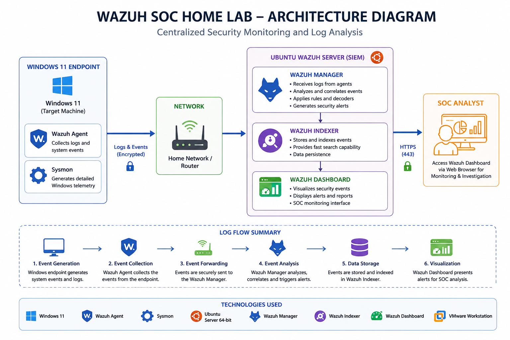
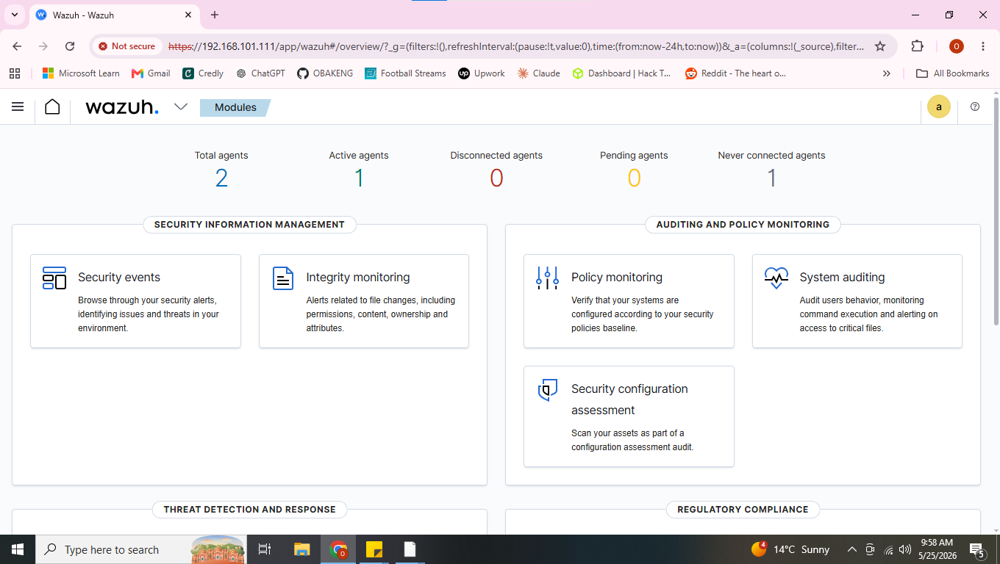
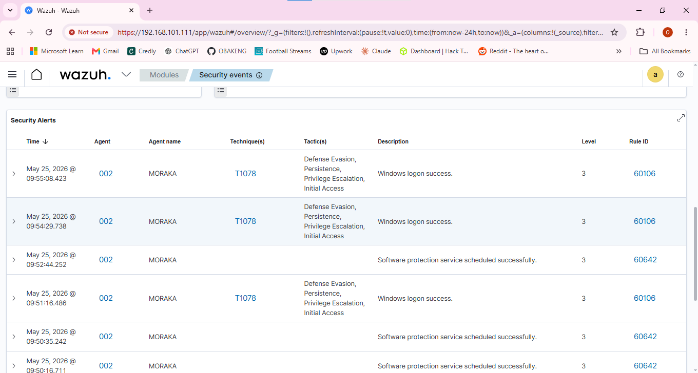
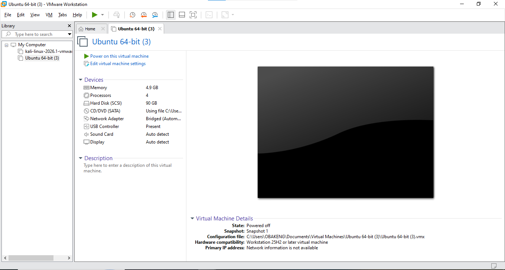
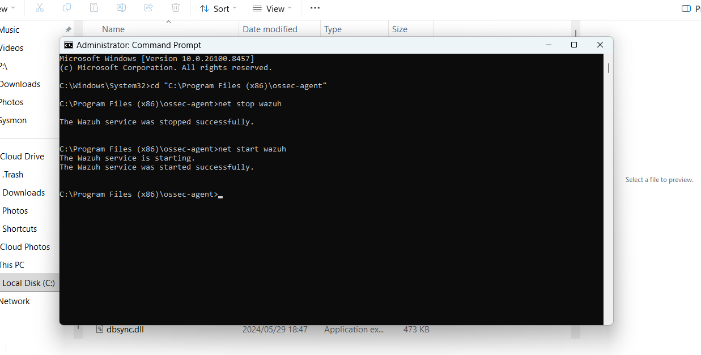

# WAZUH-TO-SOAR-HOME-LAB

PROJECT 1: WAZUH LAB SETUP
# WAZUH SOC HOME LAB – Project 1

## Project Overview

This project focused on building a functional Security Operations Center (SOC) home lab using Wazuh SIEM inside VMware.

The goal was to create a centralized monitoring environment capable of:

- Collecting endpoint logs
- Monitoring security events
- Detecting suspicious activity
- Visualizing alerts
- Simulating SOC analyst workflows

---

## Lab Environment

### Infrastructure

| Component | Purpose |
|------------|----------|
| VMware Workstation | Virtualization platform |
| Ubuntu Server | Hosts Wazuh services |
| Wazuh Manager | Event analysis and correlation |
| Wazuh Indexer | Stores security event data |
| Wazuh Dashboard | Visualization interface |
| Windows 11 Endpoint | Monitored target system |
| Wazuh Agent | Collects endpoint telemetry |
| Sysmon | Generates detailed Windows security logs |

---

## Architecture Diagram



---

## Network Flow Explanation

### Step 1: Event Generation

The Windows endpoint generates system events including:

- Process creation
- User logons
- PowerShell execution
- File activity
- Security events
- Service activity

↓

### Step 2: Event Collection

The Wazuh Agent installed on the Windows endpoint collects endpoint logs.

↓

### Step 3: Event Forwarding

The collected events are forwarded to the Wazuh Manager hosted on the Ubuntu server.

↓

### Step 4: Event Analysis

The Wazuh Manager:

- Analyzes events
- Correlates logs
- Applies detection rules
- Maps activity to MITRE ATT&CK techniques

↓

### Step 5: Data Storage

The Wazuh Indexer stores processed security events.

↓

### Step 6: Visualization

The Wazuh Dashboard presents alerts for SOC analysis and investigation.

---

## Installation Process

### VMware Environment Setup

Created the following virtual machines:

- Ubuntu Server VM
- Windows 11 Endpoint VM

Configured:

- CPU allocation
- RAM allocation
- Disk allocation
- Bridged networking

---

### Wazuh Deployment

Installed:

- Wazuh Manager
- Wazuh Indexer
- Wazuh Dashboard

Configured:

- Dashboard access
- Agent communication
- Network connectivity

---

### Windows Endpoint Configuration

Installed:

- Wazuh Agent
- Sysmon

Configured:

- ossec.conf
- Event forwarding
- Service startup

---

## Challenges Encountered and Resolutions

### Issue 1: VMware VMDK Lock File Error

#### Problem

```text
Cannot open disk
Another process has locked a portion of the file
```

#### Cause

VMware processes remained active after previous VM operations.

#### Resolution

Actions performed:

- Closed VMware completely
- Opened Task Manager
- Terminated VMware background processes
- Restarted VMware

#### Result

Virtual machine booted successfully.

---

### Issue 2: VM IP Address Changed After Reboot

#### Problem

The Wazuh agent failed to communicate with the server.

#### Cause

The VM received a different IP address from DHCP.

#### Resolution

Verified new IP:

```bash
ip a
```

Updated:

- Wazuh Agent configuration
- Dashboard connection settings

Restarted services.

#### Result

Agent connectivity restored.

---

### Issue 3: Agent Enrollment Failure

#### Problem

```text
Unable to connect to enrollment service
```

#### Cause

Incorrect communication between endpoint and Wazuh server.

#### Resolution

Performed:

- Ping tests
- Network verification
- Wazuh service restart
- Agent restart

#### Result

Agent successfully enrolled.

---

### Issue 4: Wazuh Dashboard Not Ready

#### Problem

```text
Wazuh dashboard server is not ready yet
```

#### Cause

Wazuh Indexer failed to start.

#### Investigation

Checked service status:

```bash
sudo systemctl status wazuh-indexer
```

Reviewed:

- Memory allocation
- Indexer logs
- Service status

#### Resolution

Adjusted JVM memory settings and restarted services.

#### Result

Dashboard loaded successfully.

---

### Issue 5: Missing Text Editors

#### Problem

```text
nano: command not found
vi: command not found
```

#### Cause

Minimal Ubuntu installation omitted editor packages.

#### Resolution

Installed editor packages.

#### Result

Configuration files could be modified successfully.

---

## Evidence

### Wazuh Dashboard



---

### Security Event Detection



---

### VMware Environment



---

### Wazuh Agent Running



---

## Skills Demonstrated

### SIEM Skills

- Wazuh deployment
- Wazuh administration
- Alert monitoring
- Event correlation
- Dashboard analysis

### Infrastructure Skills

- VMware administration
- Linux administration
- Windows administration
- Network troubleshooting

### Security Skills

- Endpoint monitoring
- Sysmon integration
- Security event investigation
- Threat detection

---

## Lessons Learned

Building a SIEM environment involves more than installing tools.

Important learning outcomes:

- Troubleshooting connectivity issues
- Understanding log flow
- Diagnosing service failures
- Managing agents
- Investigating security alerts
- Working with system services
- Understanding endpoint telemetry

---

## Project Outcome

Successfully deployed a functioning Wazuh SOC Home Lab capable of:

✅ Collecting endpoint logs

✅ Detecting security events

✅ Generating alerts

✅ Visualizing activity

✅ Supporting future threat simulations

---

## Repository Structure

```text
WAZUH-SOC-HOME-LAB/
│
├── README.md
│
├── architecture/
│   └── architecture-diagram.png
│
├── screenshots/
│   ├── dashboard.png
│   ├── security-events.png
│   ├── vmware-setup.png
│   └── agent-running.png
│
└── report/
    └── Wazuh_Project1_Report.docx
```

---

## Future Improvements

Planned enhancements:

- Brute force attack detection lab
- PowerShell attack detection
- Malware simulation
- Active response configuration
- SOAR integration
- Threat hunting scenarios
